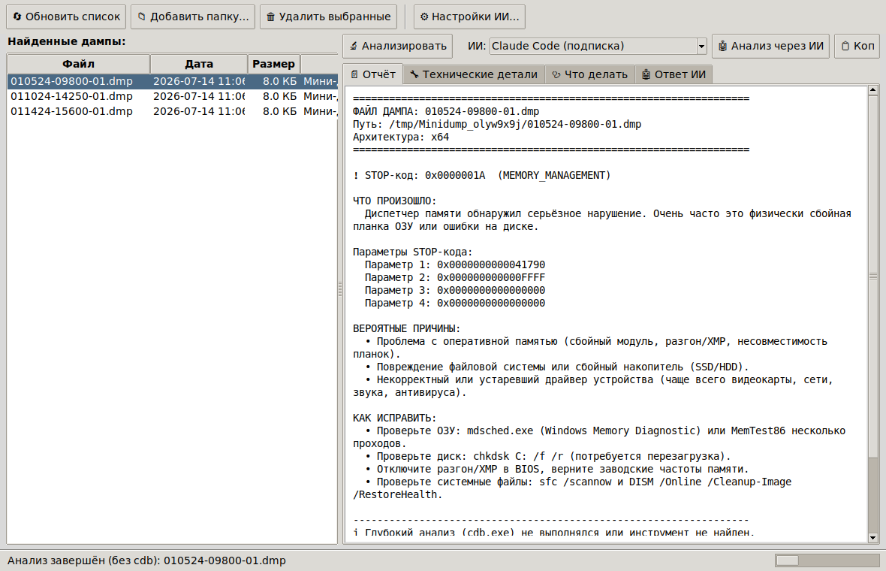

# BSOD Dump Analyzer 🖥️💥

GUI-программа на Python для **поиска и анализа дампов памяти после синих
экранов (BSOD)** в Windows. Находит дампы в системе, показывает их списком
(можно удалять), разбирает выбранный дамп и объясняет **человеческим языком**:
что случилось, почему и как это исправить. Есть кнопка **Autofix** с
безопасными проверками и интеграция с **установленными ИИ по подписке**
(Claude Code, Codex, Grok) — **без API и отдельного биллинга**.



## Возможности

- 🔍 **Автопоиск дампов** в стандартных местах Windows:
  `C:\Windows\Minidump`, `C:\Windows\MEMORY.DMP`,
  `%LOCALAPPDATA%\CrashDumps`, `LiveKernelReports`, WER — плюс свои папки.
- 🗑️ **Управление дампами**: список с датой/размером/типом, удаление
  выбранных прямо из окна.
- 🧠 **Разбор без сторонних библиотек**: читает заголовок дампа, достаёт
  **STOP-код (bugcheck)** и его 4 параметра; для дампов приложений — код
  исключения. Встроенная база ~40 самых частых STOP-кодов с объяснениями и
  готовыми шагами по устранению — на русском.
- 🔬 **Глубокий анализ через `cdb.exe`** (если установлены *Debugging Tools
  for Windows*): запускает `!analyze -v`, определяет **виновный драйвер**,
  bucket сбоя, стек. Программа находит `cdb.exe` автоматически.
- 🤖 **Анализ через ИИ на вашей подписке** (без API-биллинга): детект
  установленных CLI (`claude -p`, `codex exec`, `grok`), запуск как
  подпроцесс — работают все плюшки подписки. Для Claude Desktop / Grok Build
  без CLI — кнопка **«Копировать промпт»** (вставляете в чат вручную).
- 🛠️ **Autofix**: запускает только **безопасные** неразрушающие проверки
  (`sfc /scannow`, `DISM ... /RestoreHealth`, `chkdsk /scan`) от имени
  администратора, а рискованные шаги (тест ОЗУ, обновление драйверов,
  `chkdsk /f /r`, Driver Verifier) показывает как осознанный план на вкладке
  «Что делать».

## Требования

- **Windows** (BSOD — это про Windows). Для реального поиска дампов и
  Autofix нужна Windows 10/11.
- **Python 3.8+** — при установке отметьте галочку *«Add Python to PATH»*.
  `tkinter` входит в стандартную поставку Python для Windows, ничего
  доустанавливать не нужно.
- *(Опционально, но рекомендуется)* **Debugging Tools for Windows** — входят
  в [Windows SDK](https://developer.microsoft.com/windows/downloads/windows-sdk/)
  (при установке достаточно отметить только «Debugging Tools for Windows»).
  Дают точное определение виновного драйвера через `!analyze -v`.
- *(Опционально)* установленные и авторизованные ИИ-CLI: Claude Code, Codex
  CLI, Grok CLI.

## Запуск

Самый простой способ — двойной клик по **`Запустить_анализатор.bat`**.

Либо из командной строки в папке проекта:

```bat
python run_analyzer.pyw
```

или как модуль:

```bat
python -m bsod_analyzer
```

> Для удаления дампов и запуска Autofix (`sfc`/`DISM`/`chkdsk`) нужны права
> администратора — программа сама запросит их через UAC, когда потребуется.

## Как пользоваться

1. Запустите программу — слева появится список найденных дампов (свежие
   сверху). Если синих экранов давно не было, список может быть пустым — это
   хорошо.
2. Выберите дамп и нажмите **«Анализировать»** (или двойной клик).
3. Читайте вкладку **«Отчёт»** — там простым языком: что за STOP-код, причины
   и как чинить. Технический вывод `cdb` — на вкладке **«Технические
   детали»**, план действий — на **«Что делать»**.
4. Для развёрнутого разбора нажмите **«Анализ через ИИ»** (выбрав ИИ в
   выпадающем списке) — ответ появится на вкладке **«Ответ ИИ»**. Или
   **«Копировать промпт»** и вставьте в Claude Desktop / Grok Build.
5. Кнопка **«Autofix»** запускает безопасные проверки от админа.

## Настройка ИИ

Кнопка **«Настройки ИИ…»** позволяет:

- включить/выключить `cdb.exe` и указать к нему путь вручную;
- задать таймаут ответа ИИ;
- **поправить команду запуска** каждого ИИ-CLI. Плейсхолдеры:
  `{exe}` — найденный исполняемый файл, `{prompt}` — текст промпта. Если
  `{prompt}` в шаблоне нет, промпт подаётся в `stdin`. Примеры по умолчанию:
  - Claude Code: `{exe} -p {prompt}`
  - Codex CLI: `{exe} exec {prompt}`
  - Grok CLI: `{exe} {prompt}`

Точный синтаксис разных версий CLI может отличаться — если ИИ не отвечает,
поправьте шаблон здесь. Настройки хранятся в
`%APPDATA%\BSODAnalyzer\config.json`.

## Почему без API

Программа **не использует платные API-ключи**. Она запускает уже
установленные у вас приложения/CLI, которые авторизованы под вашей
подпиской (Claude Max/Pro, ChatGPT/Codex, SuperGrok). Поэтому запросы идут
через подписку, а не через отдельно тарифицируемый API.

## Структура проекта

```
bsod_analyzer/
  bugcheck_db.py   — база STOP-кодов и кодов исключений (человеческие описания)
  dump_finder.py   — поиск и удаление файлов дампов
  dump_parser.py   — разбор заголовков дампов + интеграция с cdb.exe
  report.py        — человеческий отчёт и промпт для ИИ
  ai_backends.py   — детект и запуск ИИ-CLI (без API)
  remediation.py   — план устранения и категоризация по STOP-коду
  autofix.py       — безопасный запуск проверок с правами администратора
  config.py        — загрузка/сохранение настроек
  gui.py           — интерфейс Tkinter
run_analyzer.pyw   — точка входа (без окна консоли)
Запустить_анализатор.bat — лаунчер для двойного клика
tests/             — юнит-тесты парсера и отчётов
```

## Тесты

```bat
python -m unittest discover -s tests -v
```

## Ограничения и безопасность

- Полноценный поиск дампов, `cdb`, Autofix и запуск ИИ-CLI работают **в
  Windows**. На других ОС окно откроется, но список дампов будет пустым
  (можно вручную добавить папку с `.dmp` для проверки разбора).
- Без *Debugging Tools for Windows* программа определяет STOP-код и причины
  по базе, но **не** называет конкретный виновный драйвер — для этого нужен
  `cdb.exe`.
- Autofix выполняет только неразрушающие проверки и всегда просит
  подтверждение. Рискованные операции (Driver Verifier, `chkdsk /f /r`,
  обновление/откат драйверов) вынесены в план и выполняются вами осознанно.
